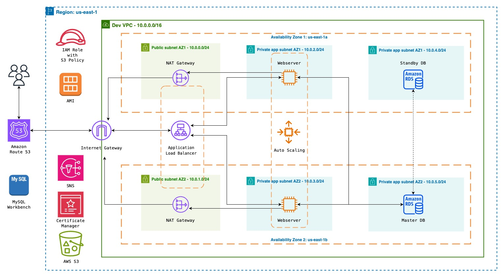

# eCommerce Website Deployment on AWS

## Overview

This project deploys a dynamic eCommerce website using the LAMP stack framework on AWS. The infrastructure is set up in a Virtual Private Cloud (VPC) with public and private subnets across two availability zones for high availability and fault tolerance.

## Architecture

1. **VPC Setup:**
   - Public and private subnets in 2 availability zones.
   - Internet Gateway for communication between instances in the VPC and the Internet.

2. **Resources:**
   - Nat Gateway, EC2 instance endpoints, and Application Load Balancer in Public Subnets.
   - MySQL RDS database for data storage.
   - EC2 Instances hosting the eCommerce website.
   - Auto Scaling Group for dynamically creating EC2 instances.
   - Route 53 for domain registration and DNS management.
   - AWS S3 for storing web files.

3. **Permissions:**
   - IAM Role used to grant EC2 instances permission to download web files from AWS S3.

4. **Create AMI from the current EC2 instance:**
   - From the webserver after both the website and data has been added to the EC2.

## Deployment Scripts

### Deploy eCommerce Website

```bash
# 1. Update EC2 instance
sudo su
sudo yum update -y

# 2. Install Apache
sudo yum install -y httpd httpd-tools mod_ssl
sudo systemctl enable httpd
sudo systemctl start httpd

# 3. Install PHP 7.4 (customize as needed)
sudo amazon-linux-extras enable php7.4
sudo yum clean metadata
sudo yum install php php-common php-pear -y
sudo yum install php-{cgi,curl,mbstring,gd,mysqlnd,gettext,json,xml,fpm,intl,zip} -y

# 4. Install MySQL 5.7 (customize as needed)
sudo rpm -Uvh https://dev.mysql.com/get/mysql57-community-release-el7-11.noarch.rpm
sudo rpm --import https://repo.mysql.com/RPM-GPG-KEY-mysql-2022
sudo yum install mysql-community-server -y
sudo systemctl enable mysqld
sudo systemctl start mysqld

# 5. Set permissions
sudo usermod -a -G apache ec2-user
sudo chown -R ec2-user:apache /var/www
sudo chmod 2775 /var/www && find /var/www -type d -exec sudo chmod 2775 {} \;
sudo find /var/www -type f -exec sudo chmod 0664 {} \;

# 6. Download FleetCart zip from S3 to the HTML directory
sudo aws s3 sync s3://scombey-fleetcart-web-files /var/www/html

# 7. Unzip the FleetCart zip folder
cd /var/www/html
sudo unzip FleetCart.zip

# 8. Move files and folders
sudo mv FleetCart/* /var/www/html

# 9. Move hidden files from FleetCart directory to the HTML directory
sudo mv FleetCart/{.DS_Store,.editorconfig,.env,.env.example,.eslintignore,.eslintrc,.gitignore,.htaccess,.npmrc,.php_cs,.rtlcssrc} /var/www/html

# 10. Delete the FleetCart and FleetCart.zip folder
sudo rm -rf FleetCart FleetCart.zip

# 11. Enable mod_rewrite on EC2 Linux, add Apache to group, and restart server
sudo sed -i '/<Directory "\/var\/www\/html">/,/<\/Directory>/ s/AllowOverride None/AllowOverride All/' /etc/httpd/conf/httpd.conf
chown apache:apache -R /var/www/html
sudo service httpd restart
```

### Import Dummy Data for the Website

```bash
# Switch to superuser
sudo su

# Sync dummy data from S3 bucket to the home directory
sudo aws s3 sync s3://scombey-fleetcart-dummy-data /home/ec2-user

# Unzip the dummy data zip file
sudo unzip dummy.zip

# Move dummy data files to the public directory of the website
sudo mv dummy/* /var/www/html/public

# Move hidden files from dummy directory to the public directory
sudo mv -f dummy/.DS_Store /var/www/html/public

# Remove cache data if needed (customize as per your requirements)
sudo rm -rf /var/www/html/storage/framework/cache/data/cache

# Remove dummy directory and zip file to free up space
sudo rm -rf dummy dummy.zip

# Set proper ownership for Apache user
chown apache:apache -R /var/www/html

# Restart Apache server to apply changes
sudo service httpd restart
```
